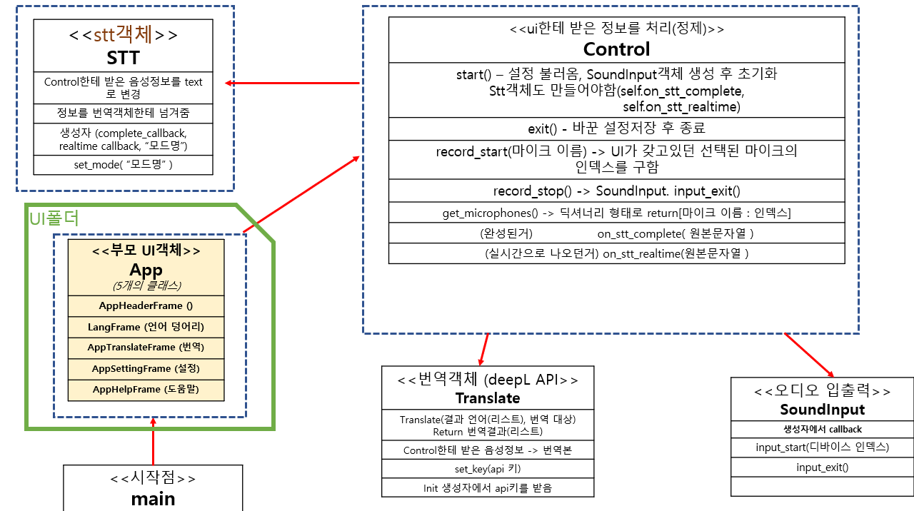

# 기술 요약!

## 개요
**Hey! Translate**는 파이썬 기반의 데스크탑 번역 프로그램입니다.  
별도의 서버 없이 로컬 환경에서 동작하며, 음성 인식(STT)과 번역 기능을 제공합니다.

- STT 기능은 Faster Whisper를 사용하여 로컬 환경에서 처리되므로 인터넷 연결이 필요하지 않습니다.
- 마이크 입력은 SoundDevice 모듈을 사용하여 STT 모델에 적합한 샘플 레이트로 처리합니다.
- 번역 기능은 DeepL API를 사용하므로 인터넷 연결이 필요합니다.
- UI는 CustomTkinter를 사용하여 기본 Tkinter보다 미려한 디자인을 제공합니다.

---

## 기술 스택

- **언어**: Python  
  https://www.python.org

- **STT (Speech To Text)**: Faster Whisper  
  https://github.com/SYSTRAN/faster-whisper

- **마이크 입력 처리**: SoundDevice  
  https://github.com/spatialaudio/python-sounddevice

- **번역**: DeepL API  
  https://www.deepl.com/en/products/api

- **UI**: CustomTkinter  
  https://customtkinter.tomschimansky.com

---

## 프로그램 구조

